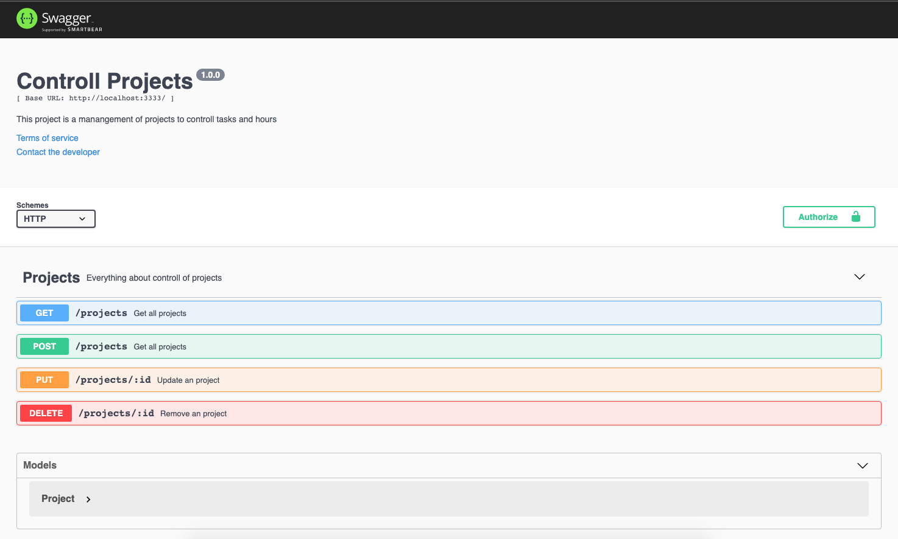

# API - Projects Controll

---

This is a API Restfull for projects controll using nodejs.

---

## Dependencies:

- Express
- Swagger
- Jest
- Node

---

## resources

---

### routes

- Projects
  - get /projects
  - post /projects
  - update /projects/:id
  - delete /projects/:id
- API DOCS
  - get /api-docs

---

## Commands

- Yarn dev
  - Run project on localhost
- Yarn test
  - Run all tests

### Todo

- [ ] Implement on Typescript
- [ ] Add eslint config
- [ ] Create CRUD users and authentication
- [ ] Add tasks on projects
- [ ] Add control time on project
